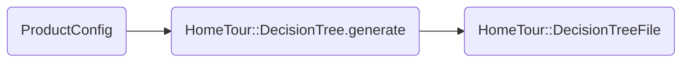
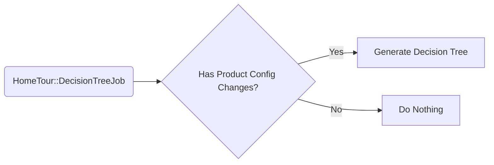
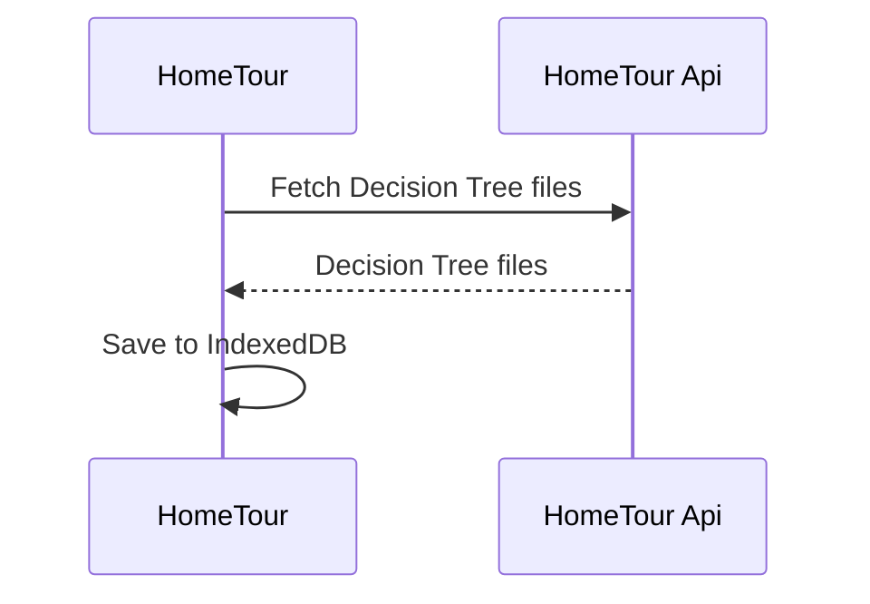
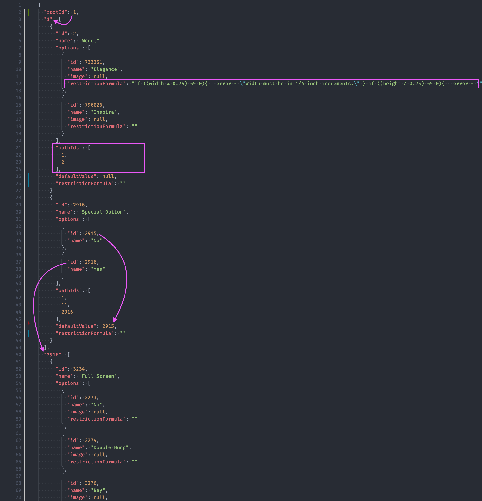

# Home Tour New Architecture

Currently, Prouct Configs are structured as a decision tree data structure which provides a bunch of interesting features, for instance:

1. Built-in workflow, e.g., when creating an estimate item, Nitro can determine which options are available based on what product config is being selected as well as what the next customization steps should be.
2. Out-of-the-box "completeness" checks: we know we are done creating an estimate item, when we reach all leaves of the decision tree for the product being customized.

However, this decision tree is complex and full of redundant steps that make the user experience not ideal. Incredibles is proposing a solution that translates the product configs decision tree into a simpler and more user friendly decision tree data structure that can be used to drive Home Tour's UI.

## Home Tour Decision Tree Generation

The incredibles team is architecting a new architecture that will not only simplify our codebase but also decouple Home Tour from Product Configs entirely, which will make the solution more flexible and easily support future changes to product configs, no more scatering product config knowledge in Home Tour codebase.

### Implementation Details

The entire architecture revolves around an "engine" that can generate a simpler and more efficient decision tree data structure for Home Tour off of Nitro's Product Config structure. This new data structure can be used to automatically drive Home Tour's UI rather than hard coding the product customization steps in code, think of a data-driven survey form 🤯.

The diagram above highlights what this process will look like: Provided the product config of a given product, for instance, product config id `1` for `Windows`, Home Tour can traverse the entire product config decision tree and transform it into a simpler and more efficient decision tree that Home Tour can use.

All the decision tree generation logic will be encapsulated within `home_tour` Nitro Component, and it is structured in a way that it can be easily extended to accomodate new use cases should we add new products, models, styles, etc to our product configs setup in the future.

The entire architecture is composed by three main pieces:

#### 1. Decision Tree Generation Job

A periodic job (how often?) will be responsible for generating Home Tour decision tree files for a given territory and product. Decision Tree files are only generated if Nitro detects changes to product configs that happend after the last time decision tree files were generated.

#### 2. Home Tour Offline Capabilities

Home Tour will then download these files on startup and cache them locally via `IndexedDB`, so the app can function offline and avoid network round-trips while users are creating estimates.

#### 4. UI Automation

The UI will then use the downloaded decision tree data structure to dynamically build the product customization form, automatically presenting the steps to the user as they make selections and optimizing the experience by auto selecting steps as needed.

